# 第五章 RAG智能审核设计与实现 - 图表

## 5.1 知识库构建流程图

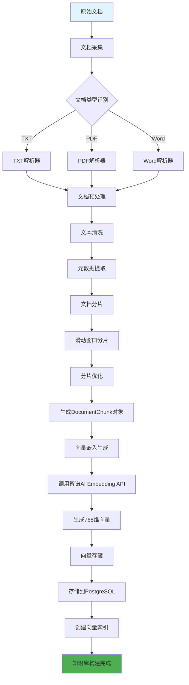

## 5.2 文档分片策略示意图

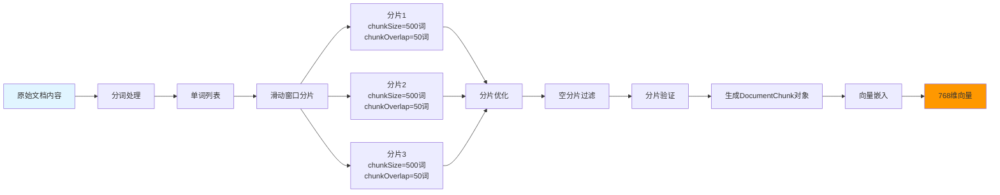

## 5.3 向量存储架构图

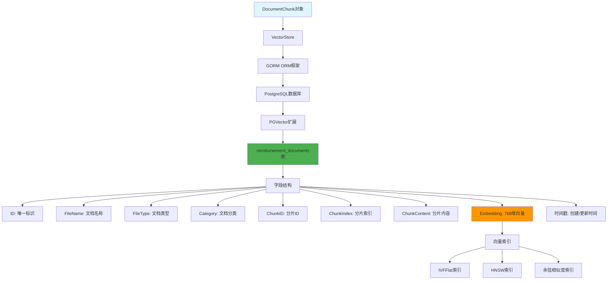

## 5.4 向量索引结构图

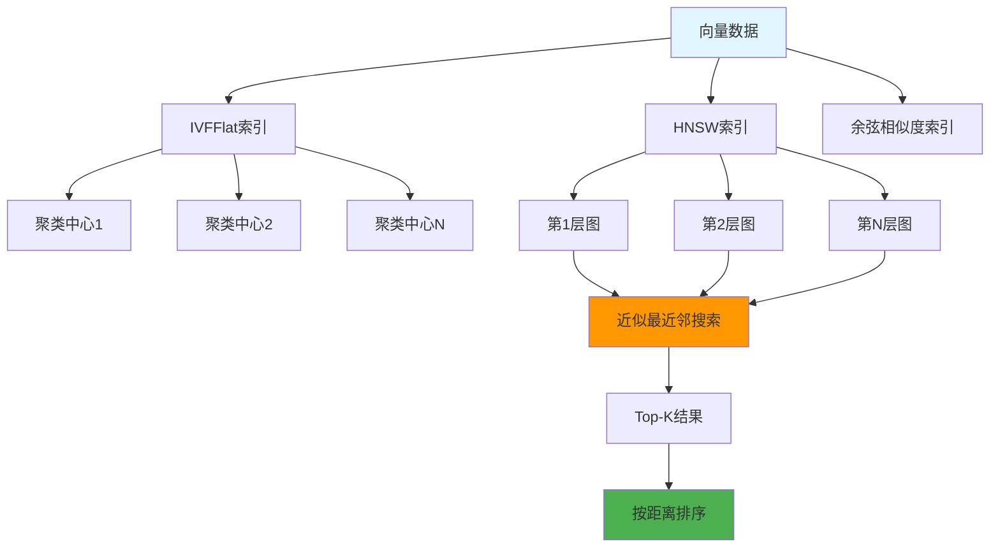

## 5.5 混合检索流程图

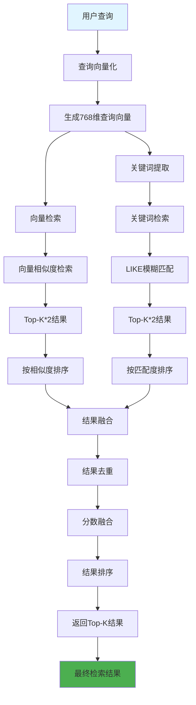

## 5.6 相似度计算流程图

```mermaid
flowchart LR
    A[查询向量] --> B[向量归一化]
    B --> C[单位向量]

    D[文档向量] --> E[向量归一化]
    E --> F[单位向量]

    C --> G[余弦相似度计算]
    F --> G

    G --> H[计算点积]
    H --> I[A·B]

    G --> J[计算模长]
    J --> K[||A|| × ||B||]

    I --> L[相似度 = 点积 / 模长]
    K --> L

    L --> M[相似度值<br/>范围: [-1, 1]]
    M --> N[1 = 完全相似]
    M --> O[0 = 不相关]
    M --> P[-1 = 完全相反]

    style A fill:#e1f5ff
    style D fill:#e1f5ff
    style M fill:#ff9800
```

## 5.7 LLM客户端架构图

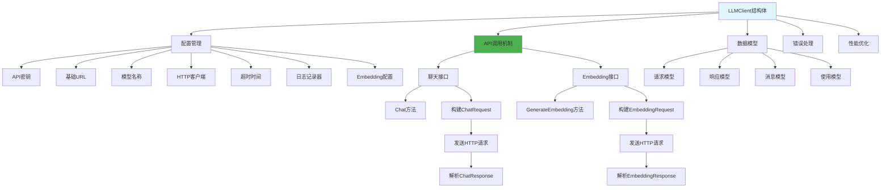

## 5.8 Prompt构建流程图

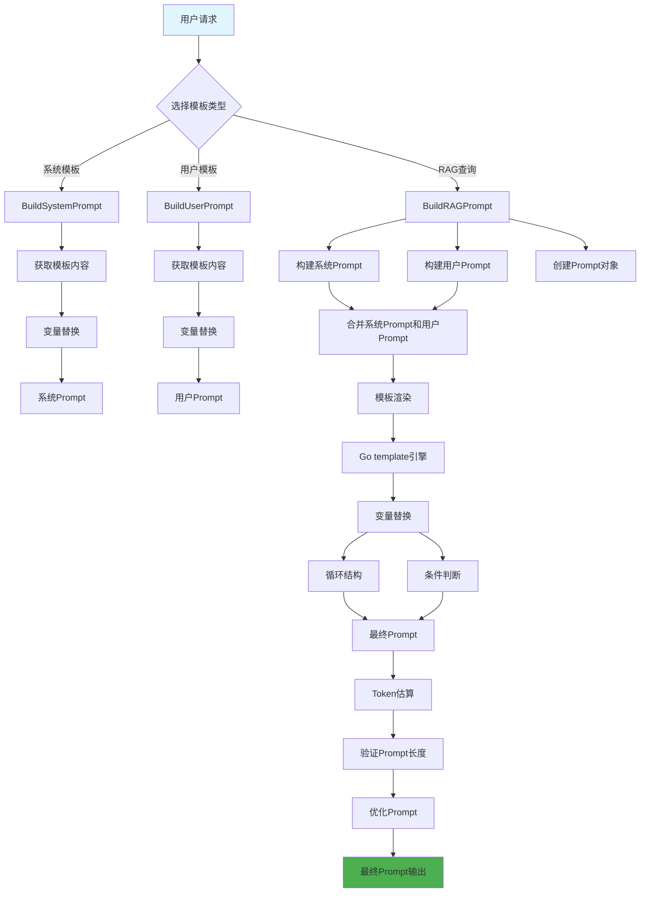

## 5.9 上下文管理架构图

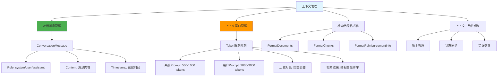

## 5.10 智能审核流程总图

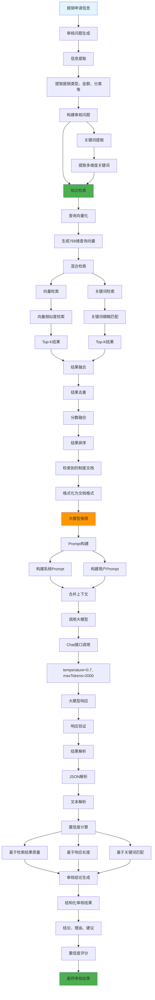

## 5.11 RAG系统整体架构图

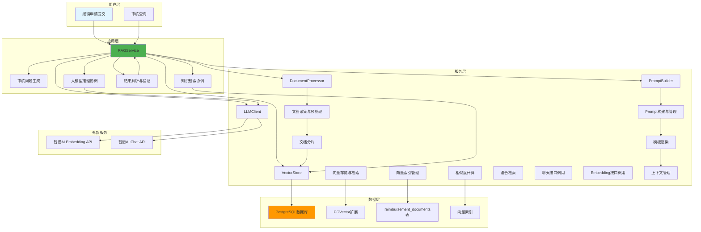

## 5.12 数据模型关系图

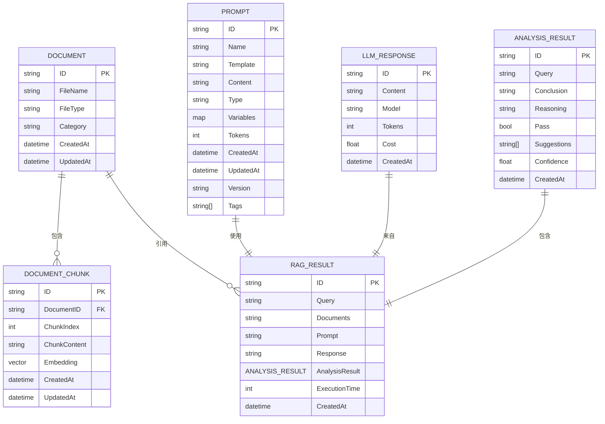

## 5.13 向量检索性能对比图

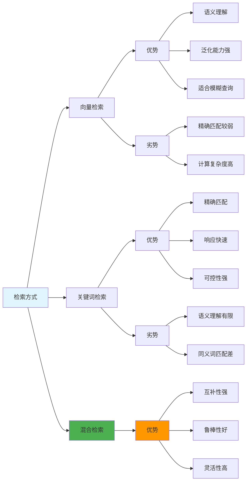

## 5.14 审核结果置信度计算模型

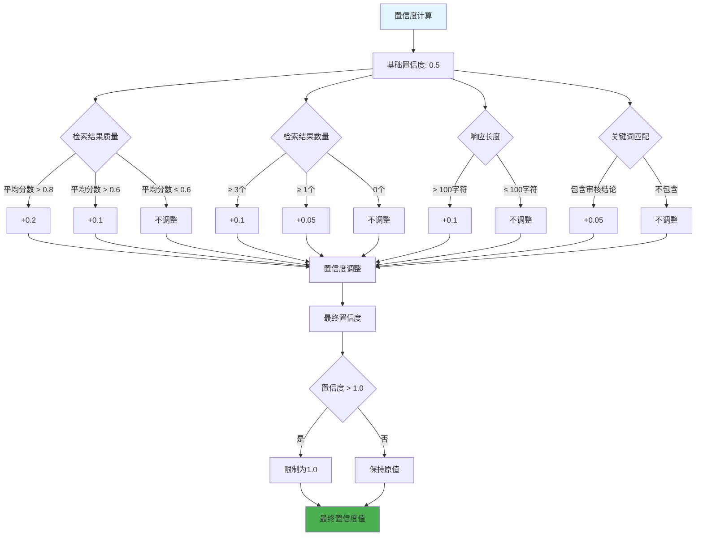

## 5.15 智能审核时序图

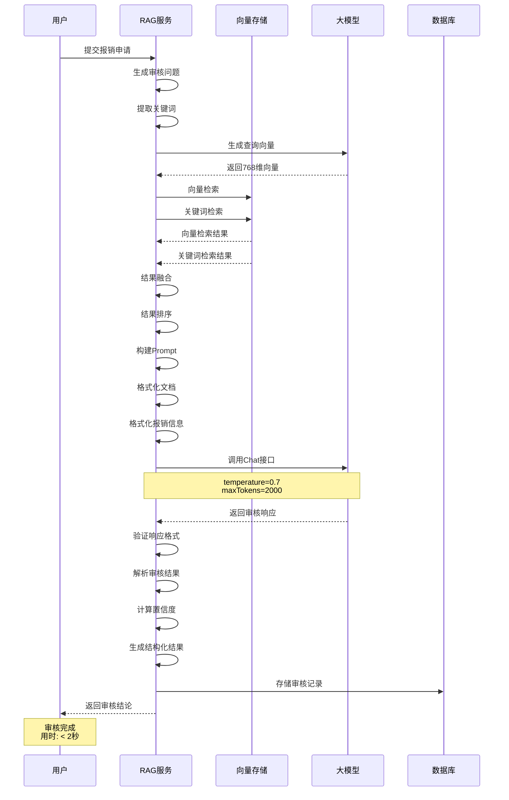

## 图表说明

本章节为第五章"RAG智能审核设计与实现"提供了15个关键图表，涵盖以下方面：

1. **知识库构建流程图** - 展示从原始文档到知识库的完整处理流程
2. **文档分片策略示意图** - 可视化滑动窗口分片算法
3. **向量存储架构图** - 展示向量存储的数据模型和索引结构
4. **向量索引结构图** - 对比IVFFlat和HNSW两种索引结构
5. **混合检索流程图** - 展示向量检索和关键词检索的融合过程
6. **相似度计算流程图** - 详细展示余弦相似度计算步骤
7. **LLM客户端架构图** - 展示LLM客户端的组件结构
8. **Prompt构建流程图** - 展示从模板到最终Prompt的构建过程
9. **上下文管理架构图** - 展示上下文管理的各个组件
10. **智能审核流程总图** - 展示完整的智能审核业务流程
11. **RAG系统整体架构图** - 展示系统的分层架构和组件关系
12. **数据模型关系图** - 展示核心数据模型之间的关系
13. **向量检索性能对比图** - 对比不同检索方式的优劣势
14. **审核结果置信度计算模型** - 展示置信度计算的决策树
15. **智能审核时序图** - 展示审核流程的时序交互

这些图表使用Mermaid语法编写，可以在支持Mermaid的Markdown编辑器中渲染，如GitHub、GitLab、Typora等工具。
