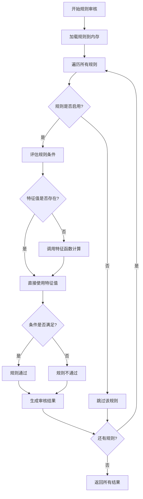
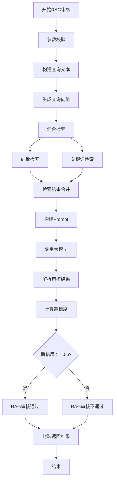
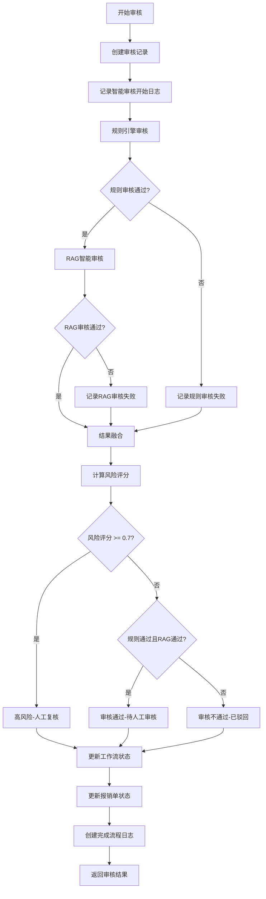
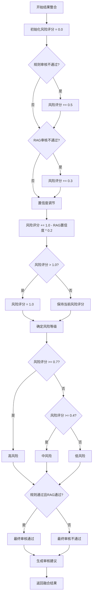
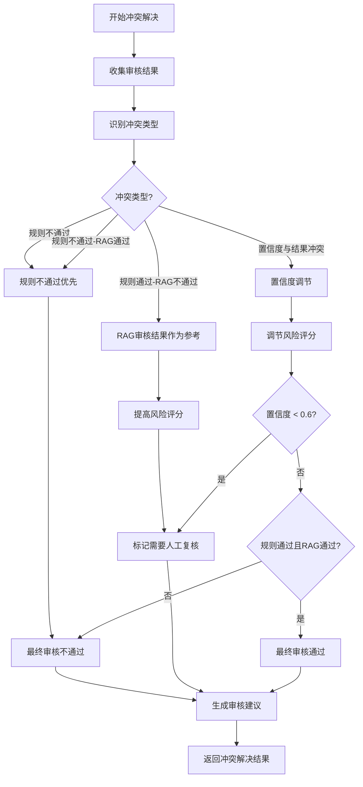
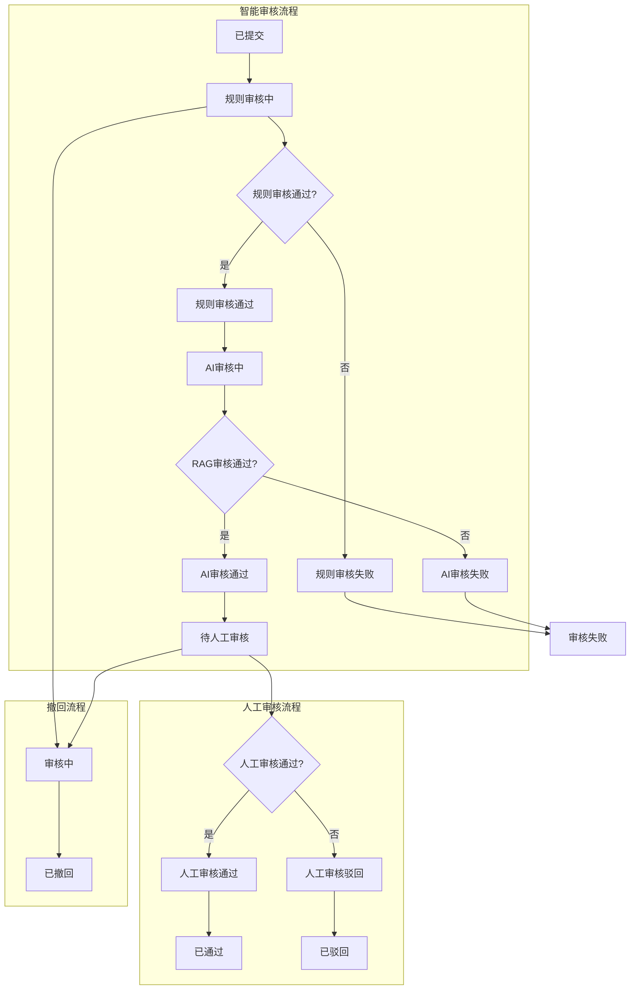
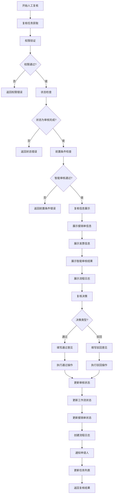

# 第六章 双层审核协同机制

## 6.1 审核流程编排

### 6.1.1 规则引擎审核流程

规则引擎审核流程是双层审核协同机制的第一层，负责对报销申请进行基于预设规则的自动化校验。该流程通过规则引擎对报销单的发票信息、金额、日期等关键要素进行快速、准确的合规性检查。

#### 流程架构设计

规则引擎审核流程采用模块化设计，主要包含规则加载、特征提取、条件评估和结果生成四个核心环节。流程的核心实现位于 `internal/domain/ruleengine/engine.go` 中的 `Engine` 结构体，通过 `ExecuteAllRules` 方法实现规则的批量执行。

规则引擎的初始化过程通过 `Initialize` 方法完成，系统从数据库中加载所有启用的规则到内存中，并为每个规则创建统计信息对象。这种预加载机制确保了规则执行的高效性，避免了每次审核时的数据库查询开销。

#### 规则执行机制

规则执行采用遍历评估策略，引擎按照规则加载顺序依次执行每个规则。每个规则包含一个或多个条件，条件之间通过逻辑运算符（AND/OR）连接。条件评估的核心实现在 `evaluateConditions` 方法中，该方法支持多种运算符类型：

- **比较运算符**：等于、不等于、大于、大于等于、小于、小于等于
- **字符串运算符**：包含、不包含

在条件评估过程中，系统首先检查所需特征值是否存在于验证数据中。如果特征值不存在，引擎会尝试通过特征函数动态计算特征值。特征函数机制通过 `featureFunctionRegistry` 实现，支持自定义的特征计算逻辑，增强了规则引擎的灵活性和扩展性。

#### 特征函数集成

特征函数是规则引擎的重要扩展机制，允许系统在规则执行过程中动态计算复杂的业务特征。特征函数的执行流程如下：

1. 通过特征ID查找特征配置信息
2. 获取特征对应的函数名称和配置参数
3. 从特征函数注册表中获取函数实现
4. 构造函数输入参数，包含发票数据和特征配置
5. 执行特征函数并获取计算结果
6. 将计算结果更新到验证数据中，供后续条件评估使用

这种设计使得规则引擎能够处理复杂的业务逻辑，如发票日期有效性检查、金额范围验证等，而无需修改核心引擎代码。

#### 审核结果生成

每个规则的执行结果被封装为 `RuleValidationResult` 对象，包含以下关键信息：

- **规则标识**：规则ID、规则代码、规则名称
- **规则类型**：标识规则来源（rule_engine）
- **执行结果**：是否通过、执行消息
- **详细信息**：条件评估详情、发票ID等上下文信息
- **性能指标**：执行时间（毫秒）

规则引擎还维护了执行统计信息，包括每个规则的执行次数、成功次数、失败次数、最后执行时间和平均执行时间。这些统计信息为规则优化和性能监控提供了数据支持。

**图6-1 规则引擎审核流程图**



### 6.1.2 RAG智能审核流程

RAG（Retrieval-Augmented Generation）智能审核流程是双层审核协同机制的第二层，利用大语言模型和检索增强生成技术，对报销申请进行基于企业报销制度的智能审核。该流程通过检索相关的制度文档，结合大模型的语义理解能力，提供更加智能和灵活的审核判断。

#### 流程设计理念

RAG智能审核流程的核心思想是将大模型的通用知识与企业的专业知识相结合。流程设计遵循以下原则：

1. **知识库驱动**：审核判断基于企业内部报销制度文档，确保审核结果的合规性和一致性
2. **检索增强**：通过向量检索和关键词检索的混合检索方式，提高相关文档的召回率
3. **上下文感知**：将报销单信息和检索到的制度片段拼接为上下文，确保大模型基于正确的知识进行判断
4. **置信度评估**：对审核结果进行置信度评分，为后续的人工复核提供参考

#### 审核流程实现

RAG智能审核流程的核心实现在 `internal/domain/rag/service.go` 中的 `AuditReimbursement` 方法，流程包含以下步骤：

**步骤1：参数校验**
系统首先校验报销信息是否为空，并设置默认的检索数量（topK=5）。这一步确保了流程的健壮性。

**步骤2：构建查询文本**
系统将报销单的结构化信息转换为自然语言查询文本。查询文本包含报销类型、金额、类别等关键信息，如"差旅费 金额700.00元 住宿费"。这种转换使得查询更加符合自然语言检索的特点。

**步骤3：生成查询向量**
系统调用大模型的embedding接口，将查询文本转换为高维向量表示。向量表示能够捕捉查询的语义信息，为后续的向量相似度计算提供基础。

**步骤4：混合检索**
系统采用向量检索和关键词检索相结合的混合检索策略。向量检索基于语义相似度，关键词检索基于精确匹配，两者结合提高了检索的准确率和召回率。关键词提取函数 `extractReimbursementKeywords` 从报销信息中提取类型、类别、金额范围、费用类型、城市等关键信息。

**步骤5：构建Prompt**
系统将报销单信息和检索到的制度文档片段拼接为Prompt。Prompt构造器 `BuildAuditPrompt` 确保了上下文的完整性和逻辑性，引导大模型基于正确的知识进行审核判断。

**步骤6：调用大模型**
系统调用大模型的Chat接口，传入系统提示词和业务Prompt。系统提示词定义了审核的规则和标准，业务Prompt提供了具体的审核上下文。大模型基于这些信息生成审核结论。

**步骤7：解析审核结果**
系统解析大模型的响应，提取审核结论、推理过程和置信度。置信度计算函数 `calculateAuditConfidence` 综合考虑了检索结果的相关度、检索文档数量、响应内容长度和结论明确性等因素。

**步骤8：封装返回结果**
系统将审核结果封装为 `RAGResult` 对象，包含查询、制度文档、Prompt、AI响应、审核结论、执行时间等完整信息。

#### 检索策略优化

RAG智能审核流程采用了多种检索优化策略：

1. **混合检索**：结合向量检索和关键词检索的优势，向量检索捕捉语义相似度，关键词检索确保关键信息的精确匹配
2. **关键词提取**：从报销信息中智能提取关键词，提高检索的针对性
3. **TopK机制**：通过调整检索数量，平衡检索的全面性和效率
4. **相关性评分**：对检索结果进行相似度评分，为后续的置信度计算提供依据

#### 审核置信度评估

RAG智能审核流程引入了置信度评估机制，对审核结果的可信度进行量化。置信度计算综合考虑以下因素：

- **检索相关度**：检索结果的平均相似度分数
- **检索数量**：检索到的相关文档数量
- **响应质量**：响应内容的长度和完整性
- **结论明确性**：响应中是否包含明确的通过或不通过结论

置信度范围为0到1，值越高表示审核结果越可信。置信度低于0.6的审核结果会被标记为需要人工复核。

**图6-2 RAG智能审核流程图**



### 6.1.3 双层审核协同策略

双层审核协同策略是整个审核系统的核心，负责协调规则引擎审核和RAG智能审核两个层次的审核流程，确保审核结果的准确性和一致性。该策略通过精心设计的流程编排和结果融合机制，实现了规则审核的严谨性和智能审核的灵活性的有机结合。

#### 协同策略设计原则

双层审核协同策略遵循以下设计原则：

1. **串行执行**：规则引擎审核和RAG智能审核按顺序执行，确保每层审核都基于完整的上下文信息
2. **结果互补**：规则审核侧重于明确的合规性检查，智能审核侧重于复杂的业务场景判断，两者相互补充
3. **容错机制**：即使某一层审核失败，系统仍继续执行后续流程，确保获得完整的审核信息
4. **风险量化**：通过风险评分机制，对审核结果进行量化评估，为人工复核提供决策支持

#### 流程编排实现

双层审核协同的核心实现在 `internal/domain/audit/service.go` 中的 `StartAudit` 方法，流程编排如下：

**阶段1：审核初始化**
系统创建审核记录，设置初始状态为"审核中"（AuditStatusRunning），工作流状态为"已提交"（WorkflowStatusSubmitted）。同时创建流程日志，记录智能审核的开始。

**阶段2：规则引擎审核**
系统将工作流状态更新为"规则审核中"（WorkflowStatusRuleAudit），并调用 `executeRuleValidation` 方法执行规则引擎审核。该方法遍历报销单的所有发票，为每张发票构建验证数据，然后调用规则引擎的 `ExecuteAllRules` 方法执行所有规则。

规则审核完成后，系统通过 `checkRulePass` 方法检查规则是否全部通过。如果规则审核失败，工作流状态更新为"规则审核失败"（WorkflowStatusRuleFailed），但系统不立即返回，而是继续执行RAG审核以获得完整的审核结果。这种设计确保了即使规则审核失败，用户也能获得智能审核的反馈信息。

**阶段3：RAG智能审核**
系统将工作流状态更新为"AI审核中"（WorkflowStatusRAGAudit），并调用 `executeRAGAnalysis` 方法执行RAG智能审核。该方法首先构建报销单信息，然后调用RAG服务的 `AuditReimbursement` 方法进行智能审核。

RAG审核完成后，系统根据置信度判断审核是否通过。置信度阈值设置为0.6，高于此阈值的审核结果被认为是可信的。如果RAG审核失败，工作流状态更新为"AI审核失败"（WorkflowStatusRAGFailed）。

**阶段4：结果融合与决策**
系统综合规则审核和RAG审核的结果，生成最终的审核决策。结果融合的核心逻辑如下：

```go
audit.FinalPass = audit.RulePass && audit.RAGPass
```

只有当规则审核和RAG审核都通过时，最终审核结果才为通过。这种严格的融合策略确保了审核结果的准确性。

系统还计算了风险评分和风险等级，为后续的人工复核提供参考。风险评分计算公式为：

```go
riskScore = 0.5 * (1 - RulePass) + 0.3 * (1 - RAGPass) + 0.2 * (1 - RAGConfidence)
```

风险等级根据风险评分确定：评分≥0.7为高风险，0.4≤评分<0.7为中风险，评分<0.4为低风险。

**阶段5：审核完成**
系统根据最终审核结果更新工作流状态和报销单状态。如果审核通过，工作流状态更新为"AI审核通过"（WorkflowStatusRAGPassed），报销单状态更新为"auditing"（待人工审核）。如果审核未通过，工作流状态更新为"AI审核失败"（WorkflowStatusRAGFailed），报销单状态更新为"rejected"（已驳回）。

最后，系统创建流程日志，记录智能审核的完成，并返回完整的审核结果。

**图6-3 双层审核协同策略流程图**



#### 流程日志机制

双层审核协同策略引入了完善的流程日志机制，记录审核流程中的每个关键节点。流程日志包含以下信息：

- **流程标识**：审核ID、报销单ID
- **流程状态**：智能审核开始、智能审核通过、智能审核失败、人工审核开始、人工审核通过、人工审核驳回、已撤回
- **流程类型**：智能审核、人工审核
- **操作信息**：操作动作、操作人ID、操作人姓名
- **上下文信息**：审核原因、审核结果、IP地址
- **时间信息**：创建时间

流程日志为审核追溯和问题排查提供了完整的历史记录，也为后续的人工复核提供了重要的上下文信息。

#### 容错与异常处理

双层审核协同策略设计了完善的容错和异常处理机制：

1. **规则校验失败**：如果规则校验过程中发生异常，系统将审核状态设置为"审核失败"（AuditStatusFailed），工作流状态设置为"规则审核失败"（WorkflowStatusRuleFailed），风险评分设置为1.0（高风险），风险等级设置为"高风险"。系统仍会创建流程日志，记录失败原因。

2. **RAG分析失败**：如果RAG分析过程中发生异常，系统将工作流状态设置为"AI审核失败"（WorkflowStatusRAGFailed），RAG审核结果设置为false。系统继续完成审核流程，确保用户获得规则审核的反馈信息。

3. **数据完整性保护**：所有数据库更新操作都包含错误处理，确保在异常情况下不会破坏数据的一致性。

这种容错设计确保了系统的健壮性，即使在部分组件失败的情况下，系统仍能提供基本的审核服务。

#### 性能优化考虑

双层审核协同策略在设计中考虑了性能优化：

1. **并行处理**：虽然规则审核和RAG审核是串行执行的，但规则引擎内部可以并行评估多个规则，提高执行效率
2. **缓存机制**：规则引擎在初始化时将规则加载到内存中，避免了每次审核时的数据库查询
3. **批量处理**：规则引擎支持批量执行所有规则，减少了函数调用的开销
4. **异步执行**：审核流程可以设计为异步执行，避免阻塞用户请求

这些性能优化措施确保了双层审核协同策略在保证审核质量的同时，也能满足系统的性能要求。

#### 扩展性设计

双层审核协同策略具有良好的扩展性：

1. **规则扩展**：通过规则管理接口，可以动态添加、修改、删除规则，无需修改核心代码
2. **特征扩展**：通过特征函数机制，可以灵活扩展特征计算逻辑
3. **审核层次扩展**：架构支持添加更多的审核层次，如第三方API审核、历史数据对比审核等
4. **决策策略扩展**：结果融合策略可以配置化，支持不同的业务场景需求

这种扩展性设计使得系统能够适应不断变化的业务需求和审核要求。

**图6-4 结果整合算法流程图**



## 6.2 审核结果融合

### 6.2.1 结果整合算法

审核结果融合是双层审核协同机制的关键环节，负责将规则引擎审核和RAG智能审核的结果进行有效整合，生成最终的审核决策。结果整合算法采用加权融合策略，通过量化不同审核层次的贡献度，实现审核结果的准确性和可靠性的平衡。

#### 融合算法设计原理

结果整合算法基于以下设计原理：

1. **层次权重分配**：根据不同审核层次的特点和重要性，分配相应的权重。规则引擎审核权重较高（0.5），因为规则审核基于明确的业务规则，结果具有确定性；RAG智能审核权重适中（0.3），因为智能审核基于语义理解和制度检索，结果具有一定的模糊性；置信度权重较低（0.2），用于调节审核结果的可信度。

2. **风险导向设计**：算法以风险评分为核心指标，通过量化审核失败的风险程度，为后续的人工复核提供明确的决策依据。

3. **简单实用原则**：算法设计避免复杂的数学模型，采用线性加权方式，确保算法的可理解性和可维护性。

#### 融合算法实现

结果整合算法的核心实现在 `internal/domain/audit/service.go` 中的 `calculateRiskScore` 方法，算法流程如下：

**步骤1：初始化风险评分**
系统将风险评分初始化为0.0，表示最低风险状态。

**步骤2：规则审核风险计算**
系统检查规则审核结果，如果规则审核未通过（`RulePass = false`），风险评分增加0.5。规则审核失败通常意味着报销单存在明确的合规性问题，如金额超标、发票过期等，因此赋予较高的风险权重。

**步骤3：RAG审核风险计算**
系统检查RAG审核结果，如果RAG审核未通过（`RAGPass = false`），风险评分增加0.3。RAG审核失败可能意味着报销单与制度要求存在潜在冲突，但由于智能审核的模糊性，风险权重相对较低。

**步骤4：置信度调节**
系统根据RAG审核的置信度进行风险调节。置信度越低，风险评分增加越多。调节公式为：

```go
riskScore += (1.0 - RAGConfidence) * 0.2
```

这种设计确保了即使RAG审核通过，如果置信度较低，系统仍会给予适当的风险提示，引导人工复核。

**步骤5：风险评分归一化**
系统对风险评分进行归一化处理，确保风险评分在0到1之间。如果计算结果超过1.0，系统将其设置为1.0。

#### 融合决策逻辑

基于风险评分，系统采用简单的二元决策逻辑：

```go
audit.FinalPass = audit.RulePass && audit.RAGPass
```

只有当规则审核和RAG审核都通过时，最终审核结果才为通过。这种严格的"与"逻辑确保了审核结果的准确性，避免了因单一审核层次通过而导致的误判。

风险评分主要用于辅助决策和人工复核，不直接影响最终的通过/不通过判断。这种设计分离了决策逻辑和风险评估，提高了系统的灵活性。

#### 融合结果表示

融合结果包含以下关键信息：

- **最终审核结果**：通过/不通过（FinalPass）
- **规则审核结果**：通过/不通过（RulePass）
- **RAG审核结果**：通过/不通过（RAGPass）
- **风险评分**：0到1之间的数值（RiskScore）
- **风险等级**：高风险/中风险/低风险（RiskLevel）
- **审核原因**：详细的审核说明（Reason）
- **审核建议**：针对审核结果的建议（Suggestions）

这种多维度的结果表示为用户提供了全面的审核信息，既包含明确的审核决策，也包含风险评估和改进建议。

### 6.2.2 冲突解决机制

冲突解决机制是审核结果融合的重要组成部分，负责处理规则引擎审核和RAG智能审核结果不一致的情况。由于两种审核方法基于不同的原理和知识来源，结果冲突是不可避免的，需要设计合理的冲突解决策略。

#### 冲突类型分析

审核结果冲突主要分为以下几种类型：

1. **规则通过-RAG不通过冲突**：规则引擎审核通过，但RAG智能审核不通过。这种情况通常发生在报销单符合明确的规则要求，但在语义层面与制度要求存在潜在冲突。

2. **规则不通过-RAG通过冲突**：规则引擎审核不通过，但RAG智能审核通过。这种情况通常发生在报销单违反了明确的规则要求，但在语义层面与制度要求一致。

3. **置信度与结果冲突**：RAG审核结果为通过，但置信度较低；或者RAG审核结果为不通过，但置信度较高。

**图6-5 冲突解决机制流程图**



#### 冲突解决策略

系统采用"规则优先，智能辅助"的冲突解决策略，具体策略如下：

**策略1：规则不通过优先**
当规则审核不通过时，无论RAG审核结果如何，系统都倾向于不通过最终审核。这种策略基于以下考虑：

- 规则审核基于明确的业务规则，结果具有确定性和可追溯性
- 规则不通过通常意味着存在明确的合规性问题
- 优先处理规则不通过情况，可以降低合规风险

**策略2：RAG审核结果作为参考**
当规则审核通过但RAG审核不通过时，系统将RAG审核结果作为风险提示，不直接否决最终审核，但会：

- 提高风险评分
- 在审核建议中明确提示RAG审核不通过的原因
- 标记为需要人工复核的高风险案例

**策略3：置信度调节**
当RAG审核结果的置信度较低时，系统通过置信度调节机制增加风险评分，引导人工复核。置信度调节不改变最终审核结果，但会影响风险等级的判定。

**策略4：人工复核触发**
系统设定人工复核触发条件，当满足以下任一条件时，系统将报销单标记为需要人工复核：

- 风险评分 ≥ 0.7（高风险）
- 规则审核不通过且RAG审核通过
- 规则审核通过且RAG审核不通过
- RAG审核置信度 < 0.6

#### 冲突解决流程

冲突解决的具体流程如下：

**步骤1：收集审核结果**
系统收集规则引擎审核和RAG智能审核的结果，包括通过/不通过状态、置信度、详细信息等。

**步骤2：识别冲突类型**
系统根据两个审核层次的结果，识别是否存在冲突，以及冲突的类型。

**步骤3：应用冲突解决策略**
系统根据冲突类型，应用相应的冲突解决策略，确定最终审核结果和风险等级。

**步骤4：生成审核建议**
系统根据冲突解决结果，生成详细的审核建议，包括冲突原因、风险提示、改进建议等。

**步骤5：触发人工复核（如需要）**
如果满足人工复核触发条件，系统将报销单标记为需要人工复核，并记录冲突详情。

#### 冲突解决示例

**示例1：规则通过-RAG不通过**
- 规则审核：通过（所有规则都满足）
- RAG审核：不通过（置信度0.5）
- 冲突解决：最终审核不通过，风险评分0.8（高风险），建议人工复核

**示例2：规则不通过-RAG通过**
- 规则审核：不通过（金额超标）
- RAG审核：通过（置信度0.8）
- 冲突解决：最终审核不通过，风险评分0.5（中风险），建议人工复核

**示例3：规则通过-RAG通过（低置信度）**
- 规则审核：通过
- RAG审核：通过（置信度0.4）
- 冲突解决：最终审核通过，风险评分0.52（中风险），建议人工复核

### 6.2.3 置信度评估

置信度评估是审核结果融合的重要辅助机制，用于量化审核结果的可信程度，为人工复核提供决策参考。置信度评估主要针对RAG智能审核结果，因为规则引擎审核结果具有确定性，不需要置信度评估。

#### 置信度评估原理

RAG智能审核的置信度评估基于以下原理：

1. **检索质量**：检索到的制度文档与报销单的相关度越高，审核结果的可信度越高
2. **检索数量**：检索到的相关文档数量越多，审核结果的依据越充分
3. **响应质量**：大模型响应的内容长度和完整性反映了审核的深度
4. **结论明确性**：响应中包含明确的通过或不通过结论，表明审核判断的确定性

#### 置信度计算方法

置信度计算采用加权评分方法，综合考虑多个因素。核心实现在 `internal/domain/rag/service.go` 中的 `calculateAuditConfidence` 方法，计算公式如下：

```go
baseConfidence := 0.5

if avgScore > 0.8 {
    baseConfidence += 0.2
} else if avgScore > 0.6 {
    baseConfidence += 0.1
}

if len(references) >= 3 {
    baseConfidence += 0.1
} else if len(references) >= 1 {
    baseConfidence += 0.05
}

if len(content) > 100 {
    baseConfidence += 0.1
}

if strings.Contains(content, "通过") || strings.Contains(content, "不通过") {
    baseConfidence += 0.05
}

if baseConfidence > 1.0 {
    baseConfidence = 1.0
}
```

#### 置信度影响因素

置信度计算主要考虑以下因素：

**因素1：检索相关度**
检索结果的平均相似度分数反映了检索文档与报销单的相关程度。相关度越高，说明检索到的制度文档越符合审核需求，审核结果的可信度越高。

- 平均相似度 > 0.8：置信度增加0.2
- 平均相似度 > 0.6：置信度增加0.1

**因素2：检索数量**
检索到的相关文档数量反映了审核依据的充分性。文档数量越多，说明审核参考的信息越全面。

- 文档数量 ≥ 3：置信度增加0.1
- 文档数量 ≥ 1：置信度增加0.05

**因素3：响应质量**
大模型响应的内容长度反映了审核的深度。内容越长，说明审核分析越详细，可信度越高。

- 响应长度 > 100字符：置信度增加0.1

**因素4：结论明确性**
响应中包含明确的通过或不通过结论，表明审核判断的确定性。

- 包含明确结论：置信度增加0.05

#### 置信度等级划分

根据置信度分数，系统将审核结果划分为三个等级：

- **高置信度**（0.8 ≤ 置信度 ≤ 1.0）：审核结果可信度高，可以直接采纳
- **中置信度**（0.6 ≤ 置信度 < 0.8）：审核结果可信度中等，建议人工复核
- **低置信度**（0.0 ≤ 置信度 < 0.6）：审核结果可信度低，必须人工复核

#### 置信度应用

置信度在审核流程中主要应用于以下场景：

**应用1：RAG审核结果判定**
系统将置信度阈值设置为0.6，高于此阈值的审核结果被认为是可信的，判定为通过；低于此阈值的审核结果被认为不可信，判定为不通过。

**应用2：风险评分调节**
置信度作为风险评分的调节因子，置信度越低，风险评分越高。这种设计确保了即使RAG审核通过，如果置信度较低，系统仍会给予适当的风险提示。

**应用3：人工复核触发**
置信度低于0.6的审核结果会触发人工复核，确保低置信度的审核结果得到人工确认。

**应用4：审核建议生成**
系统根据置信度生成相应的审核建议。高置信度时建议"审核通过，可以继续后续流程"；中低置信度时建议"请检查RAG分析结果，建议人工复核"。

#### 置信度优化方向

当前的置信度评估方法相对简单，未来可以从以下方向进行优化：

1. **引入更多评估因素**：如检索文档的权威性、制度文档的时效性、大模型的历史表现等
2. **采用机器学习方法**：基于历史审核数据，训练置信度预测模型，提高评估准确性
3. **动态阈值调整**：根据业务场景和历史数据，动态调整置信度阈值
4. **置信度反馈学习**：通过人工复核结果，不断优化置信度评估方法

这些优化方向需要在实际应用中逐步探索和验证，确保在提高评估准确性的同时，保持方法的简单性和可维护性。

## 6.3 审核流程管理

### 6.3.1 审核任务调度

审核任务调度是审核流程管理的核心功能，负责协调和管理审核任务的创建、执行和监控。任务调度机制确保审核任务能够高效、有序地执行，同时提供任务状态的可视化和监控能力。

#### 任务调度架构设计

审核任务调度采用同步执行模式，架构设计遵循以下原则：

1. **即时响应**：用户提交审核请求后，系统立即开始执行审核流程，提供快速的用户体验
2. **状态跟踪**：实时跟踪任务执行状态，为用户提供透明的进度反馈
3. **错误处理**：完善的异常处理机制，确保任务执行失败时能够及时通知用户
4. **资源管理**：合理分配系统资源，避免任务执行对系统性能造成过大影响

#### 任务调度流程

审核任务调度的核心实现在 `internal/domain/audit/service.go` 中的 `StartAudit` 方法，调度流程如下：

**阶段1：任务创建与初始化**
当用户提交审核请求时，系统创建审核任务记录，包含以下关键信息：

- **任务标识**：生成唯一的审核ID
- **报销单关联**：关联待审核的报销单ID
- **初始状态**：设置审核状态为"审核中"（AuditStatusRunning）
- **工作流状态**：设置工作流状态为"已提交"（WorkflowStatusSubmitted）
- **时间戳**：记录任务开始时间

同时，系统创建初始流程日志，记录智能审核的开始事件。

**阶段2：任务执行**
任务执行采用串行模式，按照以下顺序执行：

1. **规则引擎审核**：系统调用规则引擎服务，对报销单进行规则校验
2. **RAG智能审核**：系统调用RAG服务，对报销单进行智能审核
3. **结果融合**：系统融合两个审核层次的结果，生成最终审核决策
4. **状态更新**：系统根据审核结果更新任务状态和报销单状态

**阶段3：任务完成**
任务执行完成后，系统进行以下处理：

- **状态更新**：将审核状态更新为"审核完成"（AuditStatusCompleted）
- **结果记录**：记录完整的审核结果，包括规则审核结果、RAG审核结果、风险评分等
- **流程日志**：创建完成流程日志，记录审核完成事件
- **通知机制**：通过系统通知机制，向用户推送审核完成通知

#### 任务状态监控

系统提供任务状态监控功能，用户可以通过以下方式查询任务状态：

1. **实时查询**：通过审核ID查询任务的实时状态和进度
2. **状态变更通知**：当任务状态发生变更时，系统自动通知用户
3. **历史记录查询**：用户可以查询任务的历史状态变更记录

状态监控的核心实现在 `GetAuditStatus` 和 `GetAuditByReimbursementID` 方法中，这些方法提供实时的任务状态信息。

#### 任务异常处理

系统设计了完善的任务异常处理机制：

1. **规则校验异常**：如果规则校验过程中发生异常，系统将任务状态设置为"审核失败"（AuditStatusFailed），工作流状态设置为"规则审核失败"（WorkflowStatusRuleFailed），并记录详细的错误信息。

2. **RAG分析异常**：如果RAG分析过程中发生异常，系统将工作流状态设置为"AI审核失败"（WorkflowStatusRAGFailed），但继续完成审核流程，确保用户获得规则审核的反馈信息。

3. **系统异常**：如果系统发生不可恢复的异常，系统将任务状态设置为"审核失败"（AuditStatusFailed），并通过通知机制及时告知用户。

#### 任务重试机制

系统提供任务重试功能，允许用户重试失败的审核任务。重试机制的核心实现在 `RetryAudit` 方法中：

- **重试条件**：只有状态为"审核失败"（AuditStatusFailed）的任务才能重试
- **重试流程**：重试时系统创建新的审核任务，重新执行完整的审核流程
- **历史保留**：保留原审核任务的历史记录，便于追溯和对比分析

#### 任务撤回机制

系统提供任务撤回功能，允许用户撤回正在审核中的报销单。撤回机制的核心实现在 `WithdrawAudit` 方法中：

- **撤回条件**：只有状态为"审核中"（AuditStatusRunning）或"待人工审核"（AuditStatusManual）的任务才能撤回
- **撤回流程**：撤回时系统将审核状态更新为"已撤回"（AuditStatusWithdrawn），工作流状态更新为"已撤回"（WorkflowStatusWithdrawn），同时将报销单状态恢复为"待提交"（pending_submission）
- **流程日志**：创建撤回流程日志，记录撤回事件和原因

### 6.3.2 状态管理

状态管理是审核流程管理的基础，负责定义和管理审核任务的各种状态及其转换规则。良好的状态管理机制确保审核流程的规范性和可追溯性。

#### 状态定义体系

系统定义了两种类型的状态：审核状态（AuditStatus）和工作流状态（WorkflowStatus），两者相互配合，提供细粒度的状态管理。

**审核状态（AuditStatus）**
审核状态表示审核任务的整体状态，包含以下状态：

1. **待审核**（AuditStatusPending）：任务已创建，等待开始执行
2. **审核中**（AuditStatusRunning）：任务正在执行中
3. **审核完成**（AuditStatusCompleted）：任务执行完成，等待人工审核或最终决策
4. **审核失败**（AuditStatusFailed）：任务执行失败，需要重试或人工干预
5. **待人工审核**（AuditStatusManual）：智能审核通过，等待人工审核
6. **已通过**（AuditStatusApproved）：审核最终通过
7. **已驳回**（AuditStatusRejected）：审核最终驳回
8. **已撤回**（AuditStatusWithdrawn）：任务已被用户撤回

**工作流状态（WorkflowStatus）**
工作流状态表示审核任务在执行过程中的详细状态，包含以下状态：

1. **已提交**（WorkflowStatusSubmitted）：任务已提交，等待开始执行
2. **规则审核中**（WorkflowStatusRuleAudit）：正在执行规则引擎审核
3. **规则审核通过**（WorkflowStatusRulePassed）：规则引擎审核通过
4. **规则审核失败**（WorkflowStatusRuleFailed）：规则引擎审核失败
5. **AI审核中**（WorkflowStatusRAGAudit）：正在执行RAG智能审核
6. **AI审核通过**（WorkflowStatusRAGPassed）：RAG智能审核通过
7. **AI审核失败**（WorkflowStatusRAGFailed）：RAG智能审核失败
8. **待人工审核**（WorkflowStatusManualAudit）：等待人工审核
9. **人工审核通过**（WorkflowStatusManualPassed）：人工审核通过
10. **人工审核驳回**（WorkflowStatusManualRejected）：人工审核驳回
11. **已通过**（WorkflowStatusApproved）：审核最终通过
12. **已驳回**（WorkflowStatusRejected）：审核最终驳回
13. **已撤回**（WorkflowStatusWithdrawn）：任务已被用户撤回

#### 状态转换规则

系统定义了严格的状态转换规则，确保状态变更的合理性和一致性。

**智能审核流程状态转换**
智能审核流程的状态转换路径如下：

```
已提交 → 规则审核中 → 规则审核通过 → AI审核中 → AI审核通过 → 待人工审核
                                    ↓                    ↓
                              规则审核失败          AI审核失败
```

**人工审核流程状态转换**
人工审核流程的状态转换路径如下：

```
待人工审核 → 人工审核通过 → 已通过
            ↓
      人工审核驳回 → 已驳回
```

**撤回流程状态转换**```
撤回流程的状态转换路径如下：

```
审核中 → 已撤回
待人工审核 → 已撤回
```

**图6-6 状态转换图**



#### 状态管理实现

状态管理的核心实现在审核服务的各个方法中，通过以下机制实现：

1. **状态一致性检查**：在进行状态变更前，系统检查当前状态是否允许变更到目标状态
2. **原子性更新**：状态更新操作采用数据库事务，确保状态变更的原子性
3. **状态同步**：审核状态和工作流状态保持同步，确保两者的一致性
4. **状态历史记录**：每次状态变更都记录到流程日志中，便于追溯

#### 状态查询与过滤

系统提供强大的状态查询和过滤功能：

1. **按状态查询**：用户可以按审核状态或工作流状态查询审核任务
2. **按时间范围查询**：用户可以按时间范围查询审核任务
3. **按报销单查询**：用户可以按报销单ID查询相关的审核任务
4. **组合查询**：支持多个条件的组合查询

查询功能的核心实现在 `GetAuditByReimbursementID` 方法和审核仓储的查询方法中，这些方法提供了灵活的查询能力。

#### 状态异常处理

系统设计了状态异常处理机制：

1. **非法状态转换**：如果尝试进行非法的状态转换，系统会拒绝操作并返回错误信息
2. **状态不一致**：如果发现审核状态和工作流状态不一致，系统会记录错误日志并尝试修复
3. **状态丢失**：如果发现状态记录丢失，系统会根据流程日志重建状态信息

### 6.3.3 流程日志与追溯

流程日志与追溯是审核流程管理的重要组成部分，负责记录审核流程中的所有关键事件，为审核追溯、问题排查和审计提供完整的历史记录。

#### 流程日志设计

流程日志（AuditFlowLog）记录审核流程中的每个关键节点，包含以下关键信息：

**流程标识信息**
- **审核ID**：关联的审核任务ID
- **报销单ID**：关联的报销单ID
- **流程ID**：流程日志的唯一标识

**流程状态信息**
- **流程类型**：智能审核（intelligent）或人工审核（manual）
- **流程状态**：当前流程状态，如"智能审核开始"、"智能审核通过"、"人工审核驳回"等
- **流程动作**：触发的动作，如"start_audit"、"pass_audit"、"reject_audit"、"withdraw_audit"等

**操作信息**
- **操作人ID**：执行操作的用户ID（人工审核时）
- **操作人姓名**：执行操作的用户姓名（人工审核时）
- **IP地址**：操作发起的IP地址

**上下文信息**
- **审核原因**：审核决策的原因说明
- **审核结果**：审核决策的详细结果
- **其他信息**：其他相关的上下文信息

**时间信息**
- **创建时间**：流程日志的创建时间

#### 流程日志记录机制

系统在审核流程的关键节点自动创建流程日志：

1. **智能审核开始**：当开始执行智能审核时，记录"智能审核开始"日志
2. **规则审核完成**：当规则引擎审核完成时，记录相应的流程状态日志
3. **RAG审核完成**：当RAG智能审核完成时，记录相应的流程状态日志
4. **智能审核完成**：当智能审核完成时，记录"智能审核通过"或"智能审核失败"日志
5. **人工审核开始**：当开始人工审核时，记录"人工审核开始"日志
6. **人工审核完成**：当人工审核完成时，记录"人工审核通过"或"人工审核驳回"日志
7. **任务撤回**：当用户撤回审核任务时，记录"已撤回"日志

流程日志的创建是自动的，不需要用户手动触发。系统在执行相应操作时，自动创建流程日志记录。

#### 流程日志查询

系统提供强大的流程日志查询功能：

1. **按报销单查询**：用户可以查询特定报销单的所有流程日志
2. **按审核ID查询**：用户可以查询特定审核任务的所有流程日志
3. **按时间范围查询**：用户可以按时间范围查询流程日志
4. **按流程状态查询**：用户可以按流程状态查询流程日志

查询功能的核心实现在 `GetFlowLogsByReimbursementID` 和 `GetFlowLogsByAuditID` 方法中，这些方法提供了灵活的查询能力。

#### 审核追溯机制

审核追溯机制基于流程日志，提供完整的审核历史追溯能力：

1. **时间线追溯**：用户可以按时间顺序查看审核流程的所有事件
2. **状态变更追溯**：用户可以查看审核状态和工作流状态的所有变更历史
3. **操作追溯**：用户可以查看所有人工操作的历史记录，包括操作人、操作时间、操作内容等
4. **决策追溯**：用户可以查看审核决策的完整过程，包括规则审核结果、RAG审核结果、最终决策等

追溯机制为用户提供了完整的审核历史视图，便于理解审核决策的依据和过程。

#### 流程日志的应用场景

流程日志在审核流程管理中有多种应用场景：

1. **问题排查**：当审核出现问题时，可以通过流程日志快速定位问题发生的节点和原因
2. **审计合规**：流程日志提供了完整的审核历史记录，满足审计合规要求
3. **用户沟通**：流程日志可以作为与用户沟通的依据，解释审核决策的原因
4. **流程优化**：通过分析流程日志，可以发现流程中的瓶颈和优化点
5. **责任追溯**：流程日志记录了所有操作的详细信息，便于责任追溯

#### 流程日志的性能考虑

系统在设计流程日志时考虑了性能因素：

1. **异步写入**：流程日志的写入采用异步方式，不影响审核流程的执行效率
2. **批量写入**：多个流程日志记录可以批量写入数据库，减少数据库操作次数
3. **索引优化**：为流程日志的关键字段创建索引，提高查询效率
4. **数据归档**：对历史流程日志进行归档处理，减少在线数据量

这些性能优化措施确保了流程日志机制在提供完整追溯能力的同时，不会对系统性能造成过大影响。

#### 流程日志的安全与隐私

系统对流程日志的安全和隐私进行了充分考虑：

1. **访问控制**：只有授权用户才能访问流程日志
2. **数据脱敏**：对敏感信息进行脱敏处理，保护用户隐私
3. **日志保留**：按照法规要求保留流程日志，超过保留期限的日志自动删除
4. **审计追踪**：对流程日志的访问和操作进行审计追踪

这些安全措施确保了流程日志的安全性和合规性。

## 6.4 人工复核机制

人工复核机制是双层审核协同机制的重要组成部分，负责处理智能审核无法确定的复杂场景，确保审核结果的准确性和可靠性。人工复核机制通过智能审核和人工审核的有机结合，实现了审核效率与审核质量的平衡。

### 6.4.1 人工复核触发条件

人工复核触发条件是决定是否需要人工介入审核的关键机制。系统设计了多层次的触发条件，确保在智能审核不确定或存在潜在风险时，能够及时引入人工复核。

#### 触发条件设计原则

人工复核触发条件的设计遵循以下原则：

1. **风险导向**：以风险评估为核心，高风险案例优先触发人工复核
2. **效率平衡**：在保证审核质量的前提下，尽量减少人工复核的工作量
3. **可配置性**：触发条件支持配置化，便于根据业务需求调整
4. **透明性**：触发条件明确可查，用户可以理解为什么需要人工复核

#### 自动触发条件

系统设计了多种自动触发条件，当满足以下任一条件时，系统自动将报销单标记为需要人工复核：

**条件1：高风险评分**
当审核风险评分 ≥ 0.7时，系统自动触发人工复核。高风险评分通常意味着：

- 规则审核不通过（风险评分增加0.5）
- RAG审核不通过（风险评分增加0.3）
- RAG审核置信度较低（风险评分调节增加）

高风险案例通常存在明确的合规性问题或潜在冲突，需要人工进行详细审核。

**条件2：审核结果冲突**
当规则审核和RAG审核结果不一致时，系统自动触发人工复核。冲突情况包括：

- 规则审核通过但RAG审核不通过
- 规则审核不通过但RAG审核通过

审核结果冲突表明两种审核方法基于不同的原理得出了不同的结论，需要人工进行综合判断。

**条件3：低置信度RAG审核**
当RAG审核置信度 < 0.6时，系统自动触发人工复核。低置信度意味着：

- 检索到的制度文档相关度不高
- 检索到的相关文档数量不足
- 大模型响应内容不够详细
- 审核结论不够明确

低置信度的RAG审核结果不可靠，需要人工进行确认。

**条件4：特殊业务场景**
系统支持配置特殊业务场景的自动触发条件，如：

- 金额超过特定阈值的报销单
- 涉及敏感类别的报销单
- 来自特定部门的报销单
- 特定时间段的报销单

这些特殊业务场景可以根据企业的实际需求进行配置。

#### 手动触发条件

除了自动触发条件外，系统还支持手动触发人工复核：

**条件1：用户主动申请**
用户可以主动申请人工复核，适用于以下情况：

- 用户对智能审核结果有疑问
- 用户希望获得更详细的审核说明
- 用户认为智能审核存在误判

**条件2：审核人员主动介入**
审核人员可以主动介入审核，适用于以下情况：

- 发现智能审核存在系统性问题
- 需要对特定类型的报销单进行重点审核
- 需要对特定用户的报销单进行重点审核

**条件3：系统管理员干预**
系统管理员可以强制触发人工复核，适用于以下情况：

- 系统升级或规则变更后的过渡期
- 发现系统存在重大问题需要紧急处理
- 需要对历史数据进行重新审核

#### 触发条件优先级

系统定义了触发条件的优先级，当多个触发条件同时满足时，按照以下优先级处理：

1. **高风险评分**（优先级最高）
2. **审核结果冲突**
3. **低置信度RAG审核**
4. **特殊业务场景**
5. **手动触发**（优先级最低）

优先级设计确保了最需要人工复核的案例能够得到及时处理。

#### 触发条件配置

系统支持触发条件的配置化管理：

1. **阈值配置**：可以配置风险评分阈值、置信度阈值等关键参数
2. **权重配置**：可以配置不同触发条件的权重，调整触发逻辑
3. **场景配置**：可以配置特殊业务场景的触发规则
4. **白名单配置**：可以配置白名单，对特定报销单豁免人工复核

配置化管理使得系统能够适应不同企业的业务需求和风险偏好。

### 6.4.2 复核流程设计

复核流程设计是人工复核机制的核心，定义了人工审核的完整流程和操作规范。复核流程设计确保人工审核的规范性、一致性和可追溯性。

#### 复核流程架构

复核流程采用用户界面驱动的架构，主要包含以下组件：

1. **复核任务列表**：展示所有需要人工复核的报销单，支持按优先级、时间、风险等级等维度排序
2. **复核详情页面**：展示报销单的完整信息，包括基本信息、发票信息、智能审核结果等
3. **复核操作界面**：提供通过、驳回等操作选项，支持填写审核意见
4. **复核历史记录**：展示复核操作的历史记录，便于追溯和审计

#### 复核流程实现

复核流程的核心实现在 `internal/domain/audit/service.go` 中的 `ManualAudit` 方法，流程如下：

**阶段1：复核任务获取**
审核人员从复核任务列表中选择待复核的报销单，系统执行以下操作：

1. **权限验证**：验证审核人员是否有权限进行复核操作
2. **状态检查**：检查审核任务的状态是否为"审核完成"（AuditStatusCompleted）
3. **前置条件检查**：检查智能审核是否通过（FinalPass = true），只有智能审核通过的报销单才能进行人工复核

**阶段2：复核信息展示**
系统展示完整的复核信息，包括：

**报销单基本信息**
- 报销单ID、申请人、部门、报销类型
- 报销金额、申请日期、费用日期
- 报销原因、描述、项目信息

**发票详细信息**
- 发票类型、发票代码、发票号码
- 发票金额、税额、价税合计
- 发票日期、购买方、销售方
- 商品名称、规格型号、单位、数量

**智能审核结果**
- 规则审核结果：每个规则的执行结果、通过/不通过状态、执行时间
- RAG审核结果：审核结论、置信度、检索到的制度文档、分析过程
- 风险评估：风险评分、风险等级、审核建议

**流程日志**
- 审核流程的所有历史记录，包括状态变更、操作记录等

**阶段3：复核决策**
审核人员基于展示的信息，进行复核决策：

**决策选项**
1. **通过**：确认智能审核结果，报销单通过审核
2. **驳回**：否决智能审核结果，报销单不通过审核

**决策依据**
审核人员需要填写复核意见，说明决策的依据。复核意见包括：

- 决策原因：为什么通过或驳回
- 补充说明：对智能审核结果的补充说明
- 改进建议：对系统或流程的改进建议

**阶段4：复核执行**
系统根据审核人员的决策，执行复核操作：

**通过操作**
1. 更新审核状态为"已通过"（AuditStatusApproved）
2. 更新工作流状态为"人工审核通过"（WorkflowStatusManualPassed）
3. 更新最终审核结果为通过（FinalPass = true）
4. 更新审核原因为"人工审核通过: [复核意见]"
5. 更新报销单状态为"approved"
6. 创建复核开始流程日志
7. 创建复核通过流程日志

**驳回操作**
1. 更新审核状态为"已驳回"（AuditStatusRejected）
2. 更新工作流状态为"人工审核驳回"（WorkflowStatusManualRejected）
3. 更新最终审核结果为不通过（FinalPass = false）
4. 更新审核原因为"人工审核驳回: [复核意见]"
5. 更新报销单状态为"rejected"
6. 创建复核开始流程日志
7. 创建复核驳回流程日志

**阶段5：复核完成通知**
复核完成后，系统执行以下操作：

1. **通知申请人**：向申请人推送复核结果通知
2. **更新任务列表**：从复核任务列表中移除已完成的任务
3. **记录操作日志**：记录复核操作的详细信息，包括操作人、操作时间、IP地址等

**图6-7 人工复核流程图**



#### 复核流程控制

系统设计了复核流程的控制机制：

1. **单人复核**：每个报销单只能由一个审核人员进行复核，避免重复审核
2. **复核时限**：可以设置复核时限，超时未复核的任务自动提醒或重新分配
3. **复核权限**：只有授权的审核人员才能进行复核操作
4. **复核审计**：所有复核操作都记录在流程日志中，便于审计追溯

#### 复核流程优化

系统在复核流程设计中考虑了优化措施：

1. **批量复核**：支持批量选择报销单进行复核，提高复核效率
2. **快速复核**：对于低风险案例，提供快速复核通道，简化复核流程
3. **智能推荐**：基于历史复核数据，智能推荐复核决策，辅助审核人员判断
4. **模板回复**：提供常用的复核意见模板，减少审核人员的输入工作量

### 6.4.3 反馈学习机制

反馈学习机制是人工复核机制的重要组成部分，负责收集人工复核的反馈信息，用于优化智能审核的准确性和可靠性。反馈学习机制通过人工复核与智能审核的闭环，实现系统的持续改进。

#### 反馈学习设计理念

反馈学习机制基于以下设计理念：

1. **数据驱动**：基于人工复核的实际数据，而不是理论假设
2. **持续改进**：通过不断的反馈和学习，持续优化智能审核
3. **简单实用**：采用简单的学习方法，避免复杂的机器学习模型
4. **可解释性**：学习过程和结果可解释，便于理解和信任

#### 反馈数据收集

系统在人工复核过程中收集以下反馈数据：

**审核决策反馈**
- 人工复核决策：通过/驳回
- 智能审核决策：通过/不通过
- 决策一致性：人工复核决策与智能审核决策是否一致

**审核原因反馈**
- 人工复核原因：人工复核的详细原因
- 智能审核原因：智能审核的详细原因
- 原因差异：人工复核原因与智能审核原因的差异

**风险评估反馈**
- 人工评估风险：审核人员对报销单风险的主观评估
- 系统风险评分：智能审核的风险评分
- 风险评估准确性：系统风险评分与人工评估的一致性

**审核建议反馈**
- 人工改进建议：审核人员对系统或流程的改进建议
- 审核意见分类：对审核意见进行分类和统计
- 常见问题识别：识别审核过程中的常见问题

#### 反馈数据分析

系统对收集的反馈数据进行分析，提取有价值的信息：

**一致性分析**
分析人工复核决策与智能审核决策的一致性，计算以下指标：

- 一致率：人工复核决策与智能审核决策一致的比例
- 偏差率：人工复核决策与智能审核决策不一致的比例
- 偏差类型：偏差的类型分布（通过→驳回、驳回→通过）

一致性分析用于评估智能审核的准确性，识别需要改进的领域。

**原因分析**
分析人工复核原因与智能审核原因的差异，提取以下信息：

- 常见偏差原因：人工复核与智能审核不一致的常见原因
- 原因分类：将偏差原因进行分类，如规则问题、RAG问题、数据问题等
- 影响程度：不同偏差原因的影响程度和频率

原因分析用于定位智能审核的问题根源，指导优化方向。

**风险分析**
分析系统风险评分与人工评估的一致性，评估以下方面：

- 风险评分准确性：系统风险评分与人工评估的一致性
- 风险等级划分：风险等级划分的合理性
- 阈值设置：风险阈值设置的合理性

风险分析用于优化风险评估算法，提高风险评分的准确性。

**建议分析**
分析审核人员的改进建议，提取以下信息：

- 建议分类：将改进建议进行分类，如规则优化、RAG优化、流程优化等
- 建议优先级：根据建议的频率和影响程度确定优先级
- 可行性评估：评估建议的可行性和实施难度

建议分析用于指导系统的优化和改进方向。

#### 反馈学习应用

系统将反馈分析的结果应用于以下方面：

**规则优化**
基于反馈数据优化规则引擎：

1. **规则调整**：根据人工复核反馈，调整规则的阈值和参数
2. **规则新增**：根据人工复核发现的常见问题，新增相应的规则
3. **规则删除**：根据人工复核反馈，删除不适用或误报率高的规则
4. **规则优先级调整**：根据规则的重要性，调整规则的执行优先级

**RAG优化**
基于反馈数据优化RAG智能审核：

1. **知识库更新**：根据人工复核反馈，更新知识库中的制度文档
2. **检索策略调整**：根据检索效果，调整检索策略和参数
3. **Prompt优化**：根据审核效果，优化Prompt的设计和内容
4. **置信度阈值调整**：根据人工复核结果，调整置信度阈值

**风险评估优化**
基于反馈数据优化风险评估算法：

1. **权重调整**：根据人工评估，调整不同因素的权重
2. **阈值调整**：根据人工评估，调整风险等级的划分阈值
3. **算法优化**：根据反馈数据，优化风险评分的计算公式

**流程优化**
基于反馈数据优化审核流程：

1. **触发条件调整**：根据人工复核的工作量，调整触发条件
2. **流程简化**：根据审核人员的反馈，简化不必要的流程步骤
3. **界面优化**：根据用户体验反馈，优化复核界面的设计

#### 反馈学习机制实现

反馈学习机制的核心实现包括以下组件：

**数据收集组件**
- 在人工复核过程中自动收集反馈数据
- 支持手动录入补充反馈信息
- 提供反馈数据的查询和导出功能

**数据分析组件**
- 提供一致性分析、原因分析、风险分析、建议分析等功能
- 支持自定义分析维度和指标
- 提供分析结果的可视化展示

**优化建议组件**
- 基于分析结果自动生成优化建议
- 支持人工审核和确认优化建议
- 提供优化建议的实施跟踪功能

**效果评估组件**
- 跟踪优化措施的实施效果
- 对比优化前后的审核指标
- 提供效果评估报告

#### 反馈学习的局限性

当前的反馈学习机制存在以下局限性：

1. **数据积累**：需要积累足够的人工复核数据才能进行有效分析
2. **主观性**：人工复核决策存在一定的主观性，可能影响学习效果
3. **时效性**：反馈学习的效果需要一定时间才能体现
4. **复杂性**：某些复杂的审核场景难以通过简单的反馈学习进行优化

#### 反馈学习的未来方向

未来可以从以下方向改进反馈学习机制：

1. **机器学习**：引入机器学习算法，提高学习的自动化程度和准确性
2. **主动学习**：采用主动学习策略，选择最有价值的案例进行人工复核
3. **强化学习**：采用强化学习算法，实现系统的自我优化
4. **联邦学习**：采用联邦学习技术，在保护隐私的前提下进行跨组织学习

这些改进方向需要在实际应用中逐步探索和验证，确保在提高学习效果的同时，保持系统的简单性和可维护性。