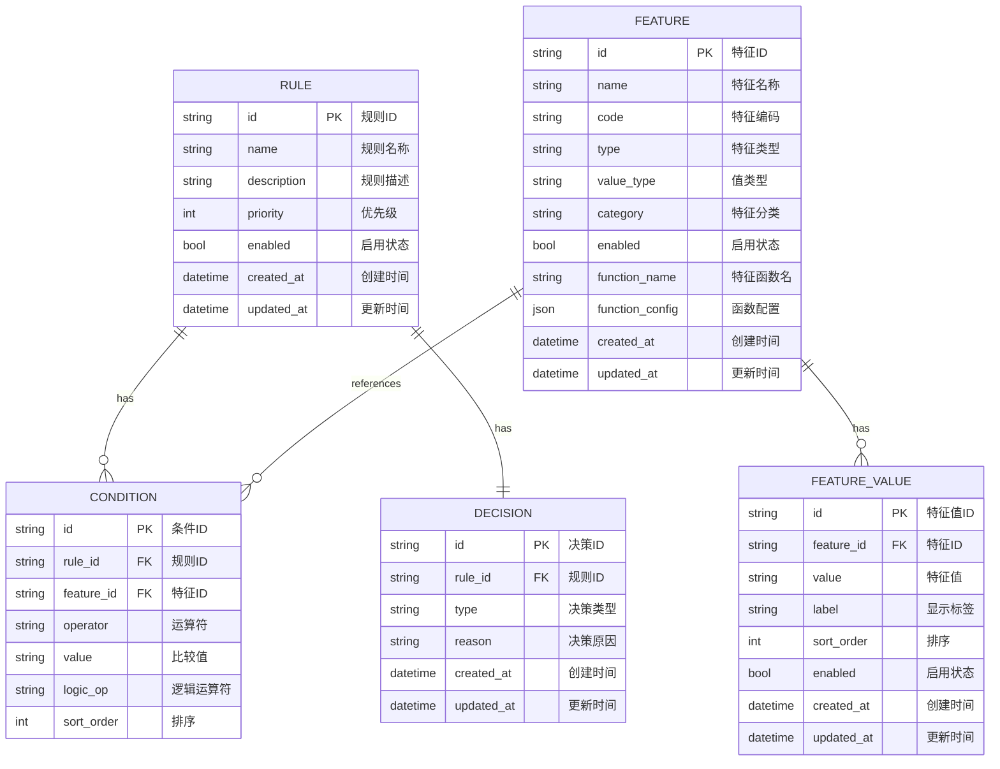
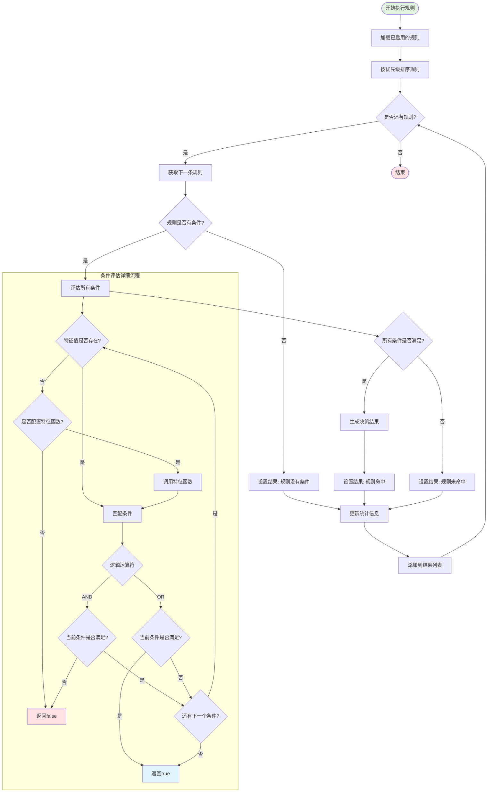

# 第四章 规则引擎设计与实现

## 4.1 规则引擎架构设计

规则引擎作为报销审计系统的核心组件，负责根据预定义的业务规则对报销单据进行自动化审核。本系统设计的规则引擎采用模块化架构，将规则定义、规则执行和规则管理三个核心功能解耦，实现了规则的可配置性、可扩展性和高性能执行。

### 4.1.1 规则定义与表示

规则定义与表示是规则引擎的基础，决定了规则的可读性、可维护性和表达能力。本系统采用结构化的规则模型，通过规则、条件和决策三个核心实体来完整描述一条业务规则。

**规则模型设计**

规则模型采用"规则-条件-决策"的三层结构，每层具有明确的职责和语义。Rule实体作为规则的顶层容器，包含规则的基本属性和元数据信息，其核心字段包括：

- 规则标识（ID）：使用UUID作为规则的全局唯一标识，确保规则在不同环境下的可追溯性
- 规则名称（Name）：描述规则的业务含义，便于业务人员理解和管理
- 规则描述（Description）：详细说明规则的适用场景和业务目的
- 优先级（Priority）：定义规则的执行顺序，数值越大优先级越高，支持灵活的规则调度策略
- 启用状态（Enabled）：控制规则是否参与执行，实现规则的动态启停
- 时间戳（CreatedAt/UpdatedAt）：记录规则的创建和更新时间，支持规则变更审计

规则通过Conditions和Decision字段分别关联条件和决策实体，形成完整的规则定义。这种设计遵循领域驱动设计（DDD）原则，将业务概念直接映射到数据模型，提高了代码的可读性和可维护性。

**条件表达式设计**

条件表达式是规则判断的核心，本系统设计了灵活的条件模型以支持复杂的业务逻辑判断。Condition实体包含以下关键属性：

- 条件标识（ID）：条件的唯一标识
- 规则标识（RuleID）：关联到所属规则，支持一对多关系
- 特征标识（FeatureID）：引用特征定义，指定条件判断的数据源
- 运算符（Operator）：定义比较操作，支持多种运算符类型
- 比较值（Value）：条件的目标值，可以是字符串、数字等类型
- 逻辑运算符（LogicOp）：定义多个条件之间的逻辑关系，支持AND和OR两种逻辑
- 排序字段（SortOrder）：控制条件的执行顺序，确保条件判断的确定性

系统支持丰富的运算符类型，以满足不同业务场景的需求：

- 相等性运算：eq（等于）、ne（不等于），用于精确匹配
- 比较运算：gt（大于）、gte（大于等于）、lt（小于）、lte（小于等于），用于数值比较
- 集合运算：in（包含于）、not_in（不包含于），用于枚举值判断
- 字符串运算：contains（包含）、not_contains（不包含），用于文本匹配

条件表达式的设计充分考虑了业务规则的复杂性和多样性，通过特征引用机制实现了条件与数据源的解耦。特征作为条件的抽象数据源，可以来自原始数据字段，也可以通过特征函数动态计算，这种设计大大提高了规则引擎的灵活性。

**决策模型设计**

决策模型定义了规则命中后的处理逻辑，Decision实体包含以下核心属性：

- 决策标识（ID）：决策的唯一标识
- 规则标识（RuleID）：关联到所属规则，实现一对一关系
- 决策类型（Type）：定义决策的动作类型，包括approve（通过）、reject（拒绝）、mark（标记）三种类型
- 决策原因（Reason）：描述规则命中的具体原因，为审计和追溯提供依据

决策类型的设计覆盖了报销审核的主要场景：approve表示报销单据符合规则要求，可以自动通过；reject表示报销单据违反规则，需要拒绝；mark表示需要人工复核或特殊标记。这种分类设计既满足了自动化审核的需求，又保留了人工干预的灵活性。

**规则数据持久化**

规则定义采用关系型数据库进行持久化存储，通过四张核心表实现规则模型的完整映射：

- rule_engine_rules表：存储规则基本信息，包含规则ID、名称、描述、优先级、启用状态等字段
- conditions表：存储规则条件，通过rule_id外键关联规则表，支持一条规则包含多个条件
- decisions表：存储规则决策，通过rule_id外键关联规则表，实现一对一关系
- features表：存储特征定义，包含特征ID、名称、编码、类型、值类型等字段

数据库设计遵循第三范式，通过外键约束保证数据一致性。为提高查询性能，关键字段建立了索引，如rule_id、feature_id、enabled等字段。规则查询时支持按名称模糊匹配、启用状态过滤、特征关联等多种查询条件，并支持分页和排序功能。

**规则模型ER图**

### 4.1.2 规则执行引擎

规则执行引擎是规则引擎的核心组件，负责加载规则、评估条件、执行决策并返回结果。本系统设计的执行引擎采用高效的模式匹配算法和并发控制机制，确保规则执行的准确性和性能。

**引擎架构设计**

规则执行引擎（Engine）采用单例模式管理，包含以下核心组件：

- 规则仓储（RuleRepository）：负责规则的持久化存储和查询，支持规则的增删改查操作
- 特征仓储（FeatureRepository）：负责特征的存储和查询，支持特征函数的配置管理
- 特征函数注册表（FeatureFunctionRegistry）：管理所有可用的特征函数，支持函数的注册和调用
- 已加载规则缓存（LoadedRules）：内存中缓存的启用规则，避免频繁访问数据库
- 规则统计信息（Stats）：记录规则的执行统计，包括执行次数、成功次数、失败次数、平均执行时间等
- 读写锁（RWMutex）：保证并发访问规则缓存和统计信息时的线程安全

引擎初始化时，从数据库加载所有启用的规则到内存缓存，并为每条规则初始化统计信息。这种设计避免了每次执行规则时都访问数据库，显著提高了执行性能。同时，引擎提供了Reload方法，支持在运行时重新加载规则，实现规则的热更新。

**规则执行流程**

规则执行流程采用"加载-评估-决策"的三阶段模式，具体步骤如下：

1. **规则加载阶段**：引擎从内存缓存中获取所有启用的规则，按优先级排序后准备执行。规则排序采用"优先级降序、更新时间降序"的策略，确保高优先级规则优先执行，相同优先级的规则按更新时间排序。

2. **条件评估阶段**：对每条规则，引擎依次评估其所有条件。条件评估采用短路求值策略，当AND逻辑中某个条件不满足时，立即停止后续条件的评估；当OR逻辑中某个条件满足时，立即返回true。这种策略大大提高了条件评估的效率。

3. **特征计算阶段**：在评估条件前，引擎会检查所需特征值是否存在于输入数据中。如果特征值不存在且该特征配置了特征函数，引擎会调用特征函数动态计算特征值。特征函数的输入包括发票数据和函数配置，输出包含计算结果和错误信息。这种设计实现了特征的按需计算，避免了不必要的计算开销。

4. **条件匹配阶段**：引擎根据条件定义的运算符和比较值，对特征值进行匹配判断。匹配逻辑支持多种数据类型，包括字符串、数字、布尔值等。对于数字类型，引擎会将值转换为浮点数进行比较；对于布尔类型，引擎会将值转换为字符串进行匹配；对于字符串类型，引擎支持精确匹配和包含匹配。

5. **决策生成阶段**：当规则的所有条件都满足时，引擎根据规则定义的决策类型和原因生成决策结果。决策结果包含规则ID、规则名称、决策类型、决策原因、执行时间等信息，为后续处理提供完整的上下文。

6. **统计更新阶段**：每次规则执行后，引擎会更新规则的统计信息，包括执行次数、成功/失败次数、最后执行时间、平均执行时间等。这些统计信息可用于规则性能分析和优化。

**规则执行流程图**

**并发控制机制**

规则执行引擎采用读写锁（RWMutex）实现并发控制，保证多线程环境下的数据一致性。具体策略如下：

- 读操作（如获取规则列表、查询统计信息）使用读锁，允许多个读操作并发执行，提高读取性能
- 写操作（如更新统计信息、重新加载规则）使用写锁，确保写操作的原子性和互斥性
- 规则评估过程本身是无状态的，不涉及共享数据的修改，因此可以并发执行多条规则

这种设计在保证线程安全的同时，最大程度地提高了并发性能。对于高并发的审核场景，引擎可以同时处理多个审核请求，每个请求独立执行规则评估，互不干扰。

**性能优化策略**

规则执行引擎在设计和实现中采用了多种性能优化策略：

1. **规则缓存**：将启用的规则加载到内存，避免每次执行都访问数据库。缓存更新采用全量刷新策略，通过Reload方法触发，确保缓存与数据库的一致性。

2. **条件短路求值**：在AND逻辑中，一旦某个条件不满足就立即返回false；在OR逻辑中，一旦某个条件满足就立即返回true。这种策略避免了不必要的条件评估，显著提高了执行效率。

3. **特征按需计算**：只有当条件需要某个特征值且该值不存在时，才调用特征函数进行计算。这种按需计算策略避免了不必要的函数调用开销。

4. **统计信息增量更新**：统计信息采用增量更新策略，每次执行后只更新必要的字段，而不是重新计算所有统计值。这种策略减少了计算开销。

5. **批量执行优化**：ExecuteAllRules方法一次性执行所有规则，避免了多次方法调用的开销。执行结果批量返回，减少了网络传输次数。

### 4.1.3 规则管理机制

规则管理机制提供了规则的完整生命周期管理功能，包括规则的创建、更新、删除、查询、启用、禁用等操作。本系统采用分层架构，通过服务层、仓储层和持久化层的协作，实现了规则管理的业务逻辑和数据访问的分离。

**服务层设计**

规则引擎服务（RuleEngineService）作为规则管理的业务逻辑层，封装了规则管理的核心功能，包含以下关键组件：

- 规则仓储（RuleRepo）：负责规则数据的持久化操作
- 条件仓储（ConditionRepo）：负责条件数据的持久化操作
- 决策仓储（DecisionRepo）：负责决策数据的持久化操作
- 特征仓储（FeatureRepo）：负责特征数据的持久化操作
- 特征值仓储（FeatureValueRepo）：负责特征值数据的持久化操作
- 特征函数注册表（FeatureFunctionRegistry）：管理特征函数的注册和调用
- 规则引擎实例（Engine）：规则执行引擎的引用
- 重新加载回调函数（ReloadCallback）：规则变更后的回调函数，用于触发引擎重新加载

服务层采用依赖注入模式，通过构造函数接收所有依赖组件，提高了代码的可测试性和可维护性。服务层的方法负责业务逻辑的处理和事务管理，确保数据的一致性和完整性。

**规则创建流程**

规则创建流程包含以下步骤：

1. **参数校验**：服务层首先对请求参数进行校验，包括规则名称不能为空、至少包含一个条件、决策类型不能为空等。参数校验在业务逻辑层进行，确保数据的完整性和有效性。

2. **规则创建**：生成UUID作为规则ID，创建Rule实体并设置基本属性，包括名称、描述、优先级、启用状态等。调用规则仓储的CreateRule方法将规则持久化到数据库。

3. **条件创建**：遍历请求中的条件列表，为每个条件生成UUID，创建Condition实体并设置属性，包括规则ID、特征ID、运算符、比较值、逻辑运算符、排序等。调用条件仓储的CreateCondition方法将条件持久化到数据库。

4. **决策创建**：生成UUID作为决策ID，创建Decision实体并设置属性，包括规则ID、决策类型、决策原因。调用决策仓储的CreateDecision方法将决策持久化到数据库。

5. **触发重新加载**：规则创建成功后，调用重新加载回调函数，触发规则引擎重新加载规则，确保新规则立即生效。

整个创建过程采用事务管理，确保规则、条件、决策的原子性创建。如果任何一个步骤失败，整个创建操作会回滚，避免数据不一致。

**规则更新流程**

规则更新流程采用"先删除后创建"的策略，确保条件列表的完整替换：

1. **规则查询**：根据规则ID查询现有规则，验证规则是否存在。

2. **规则更新**：更新规则的基本属性，包括名称、描述、优先级、启用状态。调用规则仓储的UpdateRule方法持久化更新。

3. **条件删除**：删除规则的所有现有条件，调用条件仓储的DeleteConditionsByRuleID方法。

4. **条件创建**：创建新的条件列表，流程与规则创建中的条件创建相同。

5. **决策更新**：查询现有决策，如果存在则更新，不存在则创建。调用决策仓储的UpdateDecision或CreateDecision方法持久化。

6. **触发重新加载**：规则更新成功后，触发规则引擎重新加载规则。

这种设计简化了条件更新的逻辑，避免了复杂的条件差异比较和更新操作。同时，通过事务管理确保了更新的原子性。

**规则删除流程**

规则删除流程包含以下步骤：

1. **条件删除**：首先删除规则的所有条件，调用条件仓储的DeleteConditionsByRuleID方法。

2. **规则删除**：删除规则本身，调用规则仓储的DeleteRule方法。

3. **触发重新加载**：规则删除成功后，触发规则引擎重新加载规则。

删除操作采用级联删除策略，先删除子实体（条件），再删除父实体（规则），确保数据的一致性。由于决策与规则是一对一关系，数据库的外键约束会自动处理决策的删除。

**规则查询功能**

规则查询功能提供了灵活的查询条件，支持按以下条件过滤：

- 规则名称模糊匹配：支持通过规则名称进行模糊查询，便于快速定位规则
- 启用状态过滤：支持查询已启用或已禁用的规则
- 特征关联查询：支持查询包含特定特征的规则
- 分页查询：支持分页查询规则列表，避免一次性返回大量数据
- 排序功能：支持按优先级降序、更新时间降序排序

查询结果包含规则的完整信息，包括规则基本信息、条件列表、决策信息。条件列表按排序字段升序排列，确保条件评估的顺序一致性。

**规则启停控制**

规则启停控制提供了规则的动态启用和禁用功能，通过更新规则的enabled字段实现：

- 启用规则：调用EnableRule方法，将enabled字段设置为true，触发规则引擎重新加载
- 禁用规则：调用DisableRule方法，将enabled字段设置为false，触发规则引擎重新加载

规则启停控制实现了规则的动态管理，无需重启服务即可生效。这种设计特别适用于临时调整规则执行的场景，如紧急情况下快速禁用某条规则。

**特征管理功能**

特征管理功能提供了特征和特征值的完整管理，包括创建、更新、删除、查询、启用、禁用等操作。特征作为规则条件的数据源，支持以下配置：

- 特征基本信息：包括特征名称、编码、描述、类型、值类型、分类等
- 特征函数配置：支持为特征配置特征函数，实现特征的动态计算
- 特征值列表：支持枚举型特征定义多个可选值，每个值包含值、标签、排序等属性

特征管理功能为规则引擎提供了灵活的数据源管理机制，支持静态字段和动态函数两种数据源类型，大大提高了规则引擎的表达能力。

**仓储层设计**

仓储层采用接口抽象的方式定义数据访问契约，具体实现由MySQL仓储提供。仓储接口包括：

- RuleRepository：定义规则的CRUD操作
- ConditionRepository：定义条件的CRUD操作
- DecisionRepository：定义决策的CRUD操作
- FeatureRepository：定义特征的CRUD操作
- FeatureValueRepository：定义特征值的CRUD操作

仓储层采用GORM作为ORM框架，通过预加载（Preload）功能实现关联数据的自动加载，简化了数据访问逻辑。仓储方法包含完整的错误处理和日志记录，确保数据访问的可靠性和可追溯性。

**数据一致性保证**

规则管理机制通过多种手段保证数据的一致性：

1. **事务管理**：规则创建、更新、删除操作在事务中执行，确保操作的原子性
2. **外键约束**：数据库表之间通过外键约束建立关联，保证引用完整性
3. **级联操作**：删除规则时自动删除关联的条件和决策，避免数据残留
4. **乐观锁**：通过更新时间字段实现乐观锁，避免并发更新导致的数据冲突
5. **回调机制**：规则变更后触发引擎重新加载，确保内存缓存与数据库的一致性

这些机制共同作用，确保了规则管理系统在高并发环境下的数据一致性和可靠性。
